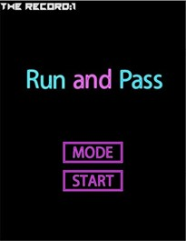

# Run and Pass 遊戲

本專案是一款使用 C++ 與 SDL 函式庫開發的小遊戲。在此遊戲中，玩家控制一個發光的黃色小球，與不斷下落的帶有算術運算（加、減、乘、除）符號的磚塊互動。每次小球與磚塊碰撞時，螢幕上方的數字會根據磚塊所表示的運算進行相應變化；當數字低於 1 時，遊戲結束並顯示 Game Over 畫面。

## 遊戲功能

- **遊戲機制：**  
  - **玩家控制：**  
    玩家透過滑鼠移動來控制小球位置。  
  - **下落磚塊：**  
    帶有數字與運算符號（加、減、乘、除）的磚塊從螢幕上方不斷掉落。  
  - **分數計算：**  
    每次碰撞發生後，根據磚塊上的運算符及數字，對螢幕上方的分數進行更新。  
  - **遊戲結束：**  
    當分數低於 1 時，遊戲結束並顯示 Game Over 畫面，玩家可選擇重新開始或退出遊戲。

- **遊戲模式：**  
  - **1D 模式：**  
    小球僅能在水平方向移動。  
  - **2D 模式：**  
    小球除了水平方向外，也能在螢幕下半部進行垂直移動。

## 運作方式

- **資源載入與初始化：**  
  - **SDL2：** 建立遊戲視窗、處理事件與繪圖。  
  - **SDL_image：** 載入與管理遊戲圖形資源。  
  - **SDL_ttf：** 用於渲染文字（例如分數與計時器）。  
  - **SDL_mixer：** 播放背景音樂與音效。  
  - 所有圖片、音樂與字型等資源均在遊戲初始化階段載入。

- **遊戲流程：**  
  - **開始畫面：**  
    顯示動畫背景以及 START 與 MODE 按鈕。  
  - **模式選擇：**  
    玩家可選擇 1D 或 2D 模式來決定小球移動方式。  
  - **遊戲進行：**  
    主迴圈中不斷生成下落磚塊，根據滑鼠操作更新小球位置，並根據碰撞情況更新分數。  
  - **遊戲結束：**  
    當分數低於 1 時，顯示 Game Over 畫面並提供返回主選單的選項。

- **物件導向設計：**  
  本專案採用了物件導向設計，主要定義了以下幾個類別：
  - **NewTexture：**  
    處理圖片與文字的載入、渲染與記憶體釋放。
  - **Pawn：**  
    表示玩家控制的小球，負責更新位置、渲染以及碰撞後外觀變化。
  - **Barrier：**  
    表示下落的磚塊，每個磚塊包含一個數字與運算符號。
  - **BarrierChain：**  
    管理所有下落磚塊，提供新增與刪除磚塊的動態陣列操作。

## 使用技術

- **程式語言：** C++
- **函式庫：**  
  - **SDL2** – 基本視窗管理與渲染  
  - **SDL_image** – 圖片載入與處理  
  - **SDL_ttf** – 文字渲染與字型管理  
  - **SDL_mixer** – 音效與背景音樂播放  
- **標準函式庫：** `<iostream>`, `<string>`, `<sstream>`, `<ctime>`, `<cstdlib>`, `<cmath>`
## DEMO
  
